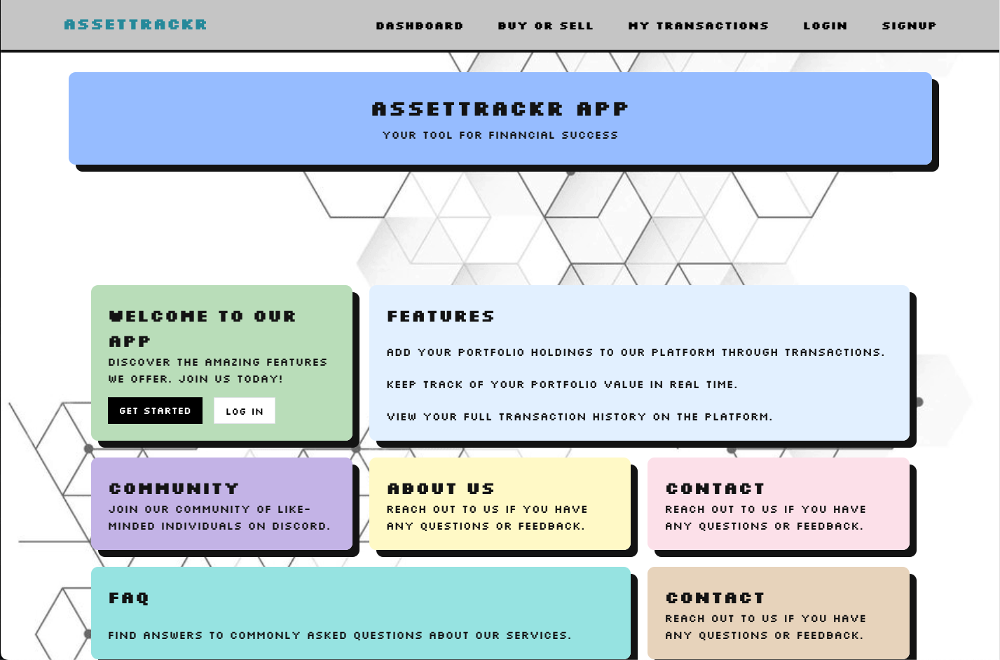
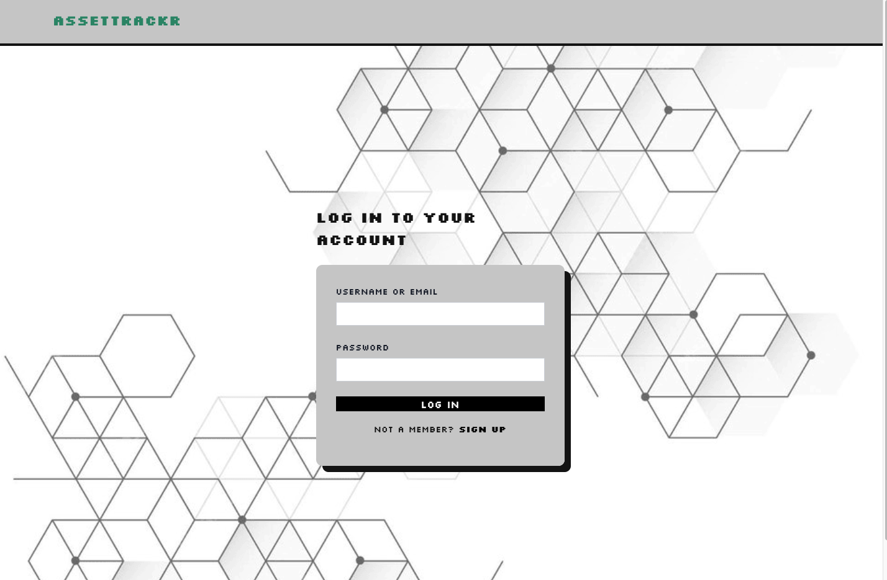
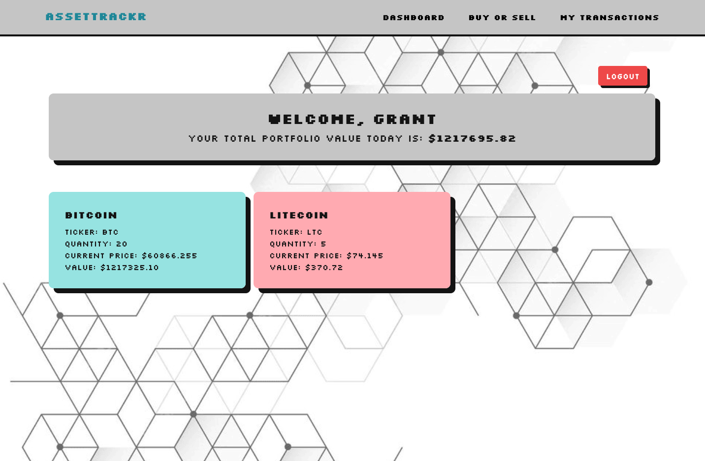
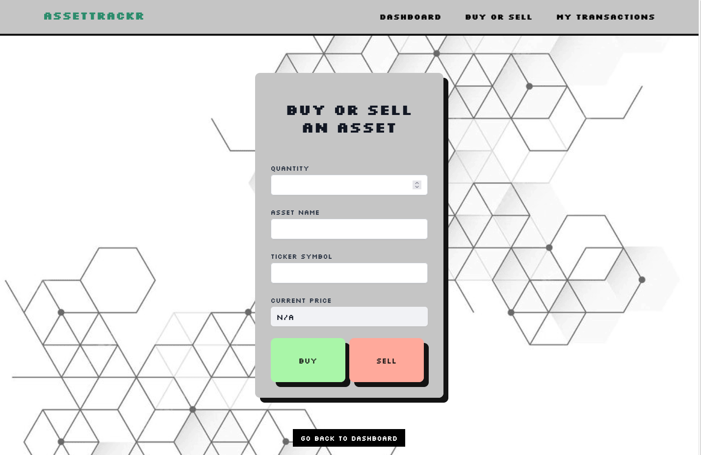
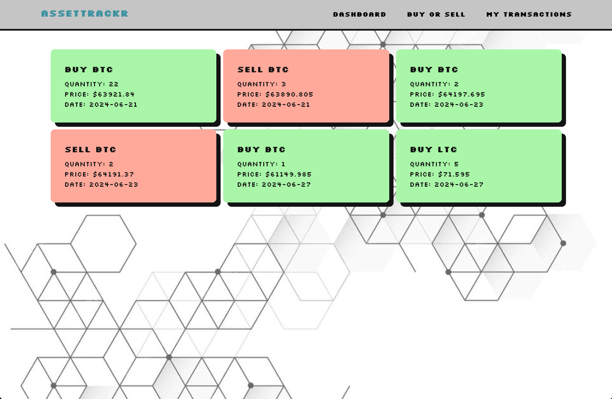

# AssetTrackr

~https://assettrackr.enrpm9tib5nri.eu-central-1.cs.amazonlightsail.com/~ (Local run only)
is a web application designed to help users manage their cryptocurrency investments. This application allows users to log buy and sell transactions, fetch live prices from the Coinbase API, and view their total portfolio value in real-time. With features like user authentication, a comprehensive dashboard, and transaction history filtering, it provides a seamless and secure experience for crypto enthusiasts.

## Table of Contents
- [Features](#features)
- [Technologies Used](#technologies-used)
- [User Flow](#user-flow)
- [Installation](#installation)
- [Usage](#usage)
- [Development Workflow](#development-workflow)
- [Contributing](#contributing)
- [Testing](#testing)
- [CI/CD Pipeline](#cicd-pipeline)
- [Future Features](#future-features)
- [Screenshots](#screenshots)
- [License](#license)

## Features
- Log buy and sell transactions for crypto assets.
- Fetch live prices using the Coinbase API.
- Calculate and display the total portfolio value.
- User authentication and authorization.
- Dashboard displaying all assets held and their current values.
- View filtered transaction history
- Containerization with Docker.
- CI/CD pipeline for automated testing and deployment.

## Technologies Used
- **Frontend:** VUE3, Typescript, Tailwind CSS, VITE
- **Backend:** NodeJS, TypeORM, Express
- **Database:** Postgres (hosted on Neon)
- **Containerization:** Docker, Docker Compose
- **Deployment:** Amazon Lightsail
- **Testing:** Jest (Unit Tests), Playwright (End-to-End Tests)

## User Flow
1. **Homepage:** Includes information about the site (Placeholder example text).
2. **Signup/Login:** Authentication and authorization for users.
3. **Dashboard:** Displays all assets held by the user and the current total value of the portfolio based on live prices.
4. **Transactions:** Users can log buy and sell transactions, which update the portfolio value accordingly.

## Installation
1. **Clone the repository:**
    ```bash
    git clone https://github.com/your-username/assettrackr.git
    cd assettrackr
    ```

2. **Install dependencies:**
    Install all dependencies (client + server):
    ```bash
    npm run install:all
    ```

3. **Set up environment variables:** use the `.env.example` file in the root directory and add the necessary environment variables:
    ```env
    DATABASE_URL=your_postgres_database_url
    etc.
    ```

4. **Run Docker Compose to start the services:**
    ```bash
    docker-compose up
    ```

5. **Run the application in dev mode:**
Run the full app in development mode (client + server concurrently):
    ```bash
    npm run dev
    ```
## Running in Production

To simulate a production environment locally:
    ```bash
    npm run build
    npm start
    ```
## Usage
- **Homepage:** Access the homepage to learn about the app.
- **Signup/Login:** Create an account or log in to access the dashboard.
- **Dashboard:** View your current assets and total portfolio value.
- **Transactions:** Add buy or sell transactions to update your portfolio.

## Development Workflow
This project uses several tools to ensure code quality and maintain a consistent development workflow:

- **Husky**: Automates git hooks for pre-commit and commit-msg validation
- **lint-staged**: Runs linters and formatters only on staged files
- **ESLint**: Enforces code quality standards
- **Prettier**: Ensures consistent code formatting
- **TypeScript**: Provides static type checking
- **Commitlint**: Enforces conventional commit message format

Run development servers (both client and server):
```bash
npm run dev
```

Format code:
```bash
npm run format
```

Lint code:
```bash
npm run lint
```

Type check:
```bash
npm run typecheck
```

## Contributing
Please read our [Contributing Guidelines](./CONTRIBUTING.md) before submitting pull requests. We follow the [Conventional Commits](https://www.conventionalcommits.org/) specification for commit messages.

## Testing
- **Backend Tests:** Run unit tests with Jest.
  ```bash
    cd server
    npm run test
    ```
- **Frontend Tests:** Run end-to-end tests with Playwright.
    ```bash
    cd client
    npm run test:e2e
    ```
    & start server for e2e
   ```bash
    cd server
    npm run test:e2e
    ```

## CI/CD Pipeline
The project uses a CI/CD pipeline for automated testing and deployment. The pipeline is configured to:
1. Run unit tests using Jest.
2. Run end-to-end tests using Playwright.
3. Deploy the application to Amazon Lightsail if all tests pass.

## Future Features
- Performance tracking charts.
- Allocation charts.
- Links to related news.

## Screenshots
Here are some screenshots of the application:

### Homepage


### Homepage


### Homepage


### Dashboard


### Dashboard


### Transactions


